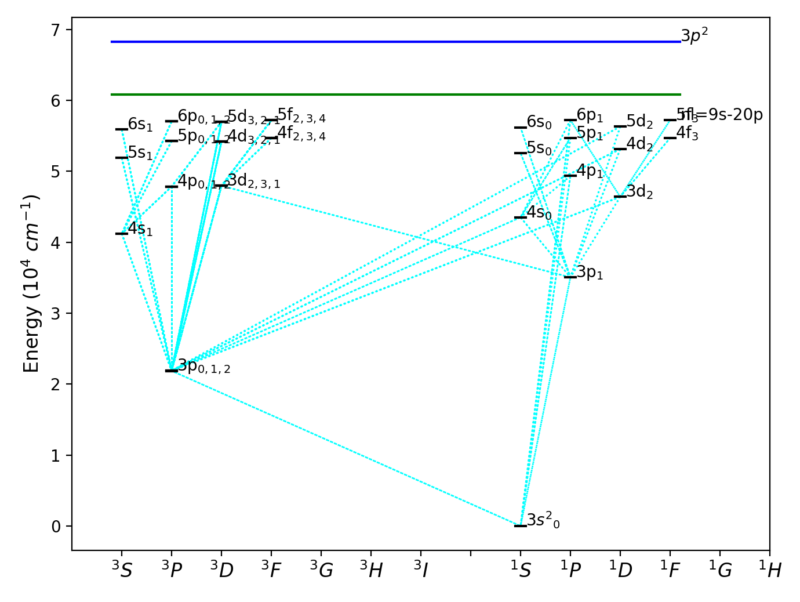

# grotrian-mgI-fig4-repro

[](https://opensource.org/licenses/MIT)
[](https://www.python.org/downloads/release/python-380/)

Reproducible code to generate a Grotrian diagram for **Mg I** (Figure 4 from Peralta et al., 2023, A&A 676, A18). This repository contains a command-line script that builds the level diagram (Grotrian) from local table files or from an SQL database (SRPM).

**Author:** Juan Ignacio Peralta (Juani) — Instituto de Astronomía y Física del Espacio (IAFE), UBA; CONICET (Argentina).  
_Last updated: 2025-08-19_


## Result



**Important:** the three atomic tables used here (for Mg I) are:
- `ModelAtomicIonLevel.dat`            — terms (levels / terms)
- `ModelAtomicIonLevelSublevel.dat`    — levels (fine-structure / sublevels)
- `ModelAtomicIonLineFine.dat`         — transitions (line fines)

The tables often come from NIST or other atomic databases, and in this repo they are
expected to contain at least the columns used by the script (see examples / generator).

---

## What this repo contains
- `src/cli.py` — main script (CLI) that produces the diagram.
- `data/` — example small tables (just the Mg I specie) to test the script without the SQL DB.
  - `ModelAtomicIonLevel.dat`
  - `ModelAtomicIonLevelSublevel.dat`
  - `ModelAtomicIonLineFine.dat`
- `notebooks/` — interactive notebook demonstrating how to call the script from Python/IPython.
- `examples/` — short run scripts and demo commands.
- `requirements.txt` — minimal Python dependencies.
- `LICENSE` — MIT.
- `CITATION.cff`

---

## Quick start (local files)

1. Create a virtual environment, install deps and run the example:

```bash
python -m venv .venv
source .venv/bin/activate         # Windows: .venv\Scripts\activate
pip install -r requirements.txt
```

2. Run with the small demo tables included in this repo:
```bash
python src/cli.py \
  --file-level data/ModelAtomicIonLevel.dat \
  --file-sublevel data/ModelAtomicIonLevelSublevel.dat \
  --file-linefine data/ModelAtomicIonLineFine.dat \
  --levs 1-25 \
  --out figures/mgI_demo.png
```

## Quick start (SQL Database)

If you have the real SRPM SQL database available (and JIP helpers):
```bash
python src/cli.py --database AtomicModelsCCA --Z 12 --ion 0 --levs 1-25 --out figures/mgI_sql.png
```
If both local files and DB are provided, local files take precedence.


## Command-line options (summary)
- --file-level PATH : local file for ModelAtomicIonLevel table (any name is fine).
- --file-sublevel PATH : local file for ModelAtomicIonLevelSublevel.
- --file-linefine PATH : local file for ModelAtomicIonLineFine.
- --database NAME : SQL database name (if using DB).
- --Z INT : atomic number (default 12).
- --ion INT : ionization state (default 0).
- --levs STR : levels selection, e.g. 1-25 or 1-10,20,30.
- --out PATH : save figure to PATH (PNG).
- --backend STR : matplotlib backend (e.g. Qt5Agg) — optional.
- --show : open interactive window (if backend allows).

**Behavior**: If --file-level and --file-sublevel are provided, the script reads the three tables from the supplied files. Otherwise it tries to fetch tables using the JIP.SQL_table helpers (SQL path).


## Data format (what the script expects)

The minimal columns used by the script (in any whitespace-separated format, header row allowed):
- ModelAtomicIonLevel must contain: LevelNumber, FullConfig, ElectronConfig
- ModelAtomicIonLevelSublevel must contain: LevelNumber, SublevelNumber, 2J, ExcitationWaven
- ModelAtomicIonLineFine must contain: LowerLevel, LowerSublevel, UpperLevel, UpperSublevel

If your files come from NIST / SRPM with different column names, rename the header columns or adapt the script.


## Reproducing Figure 4 (Peralta et al. 2023)

The provided script and the demo tables generate a figure similar in layout to Fig. 4 of the paper. For exact reproduction with original data:
- Place the three SRPM/NIST-derived files in data/ (or anywhere) and pass the paths with --file-* flags.
- Use the same levs selection as in the paper (--levs 1-25 or the list used in the paper).
- Compare the produced figures/mgI_...png with Fig.4, and if necessary adjust plot annotations (the script preserves the original annotation logic).


## Example: run from IPython / VSCode interactive

- 1) ipython
```bash
%run src/cli.py --file-level data/ModelAtomicIonLevel.dat \
                             --file-sublevel data/ModelAtomicIonLevelSublevel.dat \
                             --file-linefine data/ModelAtomicIonLineFine.dat \
                             --levs 1-25 --out figures/mgI_demo.png
```

- 2) python
```bash
from src.Grotrian_JIP_NEW import main
args = ["--file-level","data/ModelAtomicIonLevel.dat","--file-sublevel","data/ModelAtomicIonLevelSublevel.dat",
        "--file-linefine","data/ModelAtomicIonLineFine.dat","--levs","1-25","--out","figures/mgI_demo.png"]
main(args)

```


## Notes and provenance

- The script targets Mg I and reproduces the layout and labeling style for Figure 4 in:
Peralta, J. I., et al. 2023 — A&A 676, A18. (https://ui.adsabs.harvard.edu/#abs/2023A&A...676A..18P/abstract
)
- Tables may originate from NIST (https://www.nist.gov/data
) or other sources.
- The code is written to work for Mg I but can be adapted to other elements by changing --Z and --ion or by using appropriate tables.


## License & citation

Code: MIT License (see LICENSE).
If you use these scripts in publications, cite Peralta et al. 2023 (A&A) and/or the original data sources (e.g., NIST) as appropriate.
